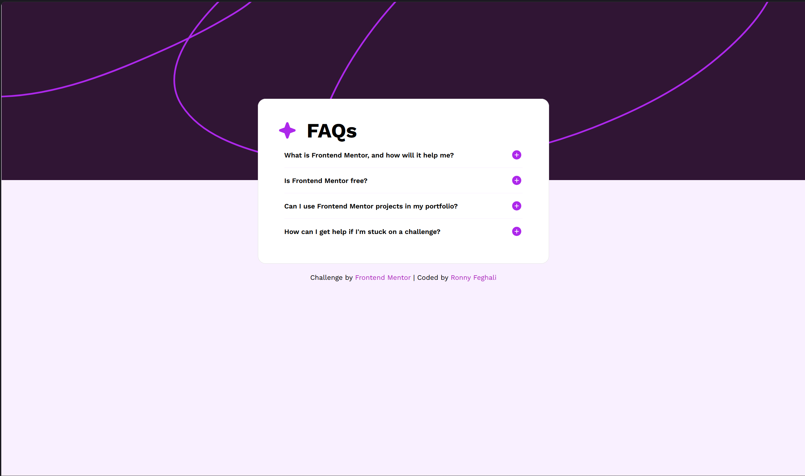

# Frontend Mentor - FAQ accordion solution

This is a solution to the [FAQ accordion challenge on Frontend Mentor](https://www.frontendmentor.io/challenges/faq-accordion-wyfFdeBwBz). Frontend Mentor challenges help you improve your coding skills by building realistic projects. 

## Table of contents

- [Overview](#overview)
  - [Level](#level)
  - [The challenge](#the-challenge)
  - [Screenshot](#screenshot)
  - [Links](#links)
- [My process](#my-process)
  - [Built with](#built-with)
  - [What I learned](#what-i-learned)
  - [Continued development](#continued-development)
  - [Useful resources](#useful-resources)
- [AI Collaboration](#ai-collaboration)
- [Author](#author)

## Overview

### Level
**Newbie**

### The challenge

Users should be able to:

- Hide/Show the answer to a question when the question is clicked
- View the optimal layout for the interface depending on their device's screen size
- See the next unanswered question highlighted in purple when a question is expanded

### Screenshot

### Links

- Solution URL: [GitHub Repository](https://github.com/yourusername/faq-accordion-main)
- Live Site URL: [Live Demo](https://your-live-site.com)

## My process

### Built with

- Semantic HTML5 markup
- CSS custom properties (variables)
- Flexbox for layout
- CSS media queries for responsive design
- Vanilla JavaScript for accordion functionality
- Mobile-first approach with breakpoints at 819px and 820px

### What I learned

This project taught me a lot about building interactive components from scratch:

**JavaScript & DOM Manipulation:**
- Using `querySelectorAll()` to select multiple elements
- Event listeners and toggling classes with `classList.toggle()`
- How parent-child relationships work in the DOM

**CSS & Responsive Design:**
- How `max-height` combined with `overflow: hidden` creates smooth accordion animations
- The difference between `justify-content` and `align-items` in flexbox
- Why fixed `margin-top` doesn't work well for centering on all screen sizes
- Creating responsive designs with multiple breakpoints for different devices
- Using `@media` queries to apply different styles at different screen widths

**Design to Code:**
- Reading Figma designs and extracting measurements
- Understanding design terminology (like "stroke" = border)
- How padding and spacing work together to create visual hierarchy

**Key Challenge I Overcame:**
The biggest issue was understanding why the accordion was expanding both up and down instead of just down. I discovered that `justify-content: center` on the body was centering the card, so when it grew, flex was adding space equally above and below. Switching to `justify-content: flex-start` and using `margin-top` fixed it.

### Continued development

Future improvements I'd like to add:

- Keyboard navigation support (using arrow keys to navigate between questions)
- Hover states to improve interactivity
- Animation on the icon rotation
- Testing across more device sizes
- Accessibility improvements (ARIA labels, focus states)

### Useful resources

- [MDN Web Docs](https://developer.mozilla.org) - Essential reference for HTML, CSS, and JavaScript
- [CSS-Tricks Flexbox Guide](https://css-tricks.com/snippets/css/a-guide-to-flexbox/) - Great visual explanations
- [Dev.to Articles](https://dev.to) - Community-written guides on web development concepts

## AI Collaboration

This project was completed with the assistance of Claude AI. For the accordion functionality—which was new to me — Claude helped me build it step-by-step, explaining how the JavaScript, CSS animations, and state management work together. For responsive design, CSS organization, and general layout challenges, Claude provided guidance and hints to help me solve problems independently. Overall, this was a collaborative learning experience where I gained hands-on understanding of building interactive components.

## Author

- Frontend Mentor - [@RonnyFeghali](https://www.frontendmentor.io/profile/yourusername)
- GitHub - [@RonnyFeghali](https://github.com/yourusername)

