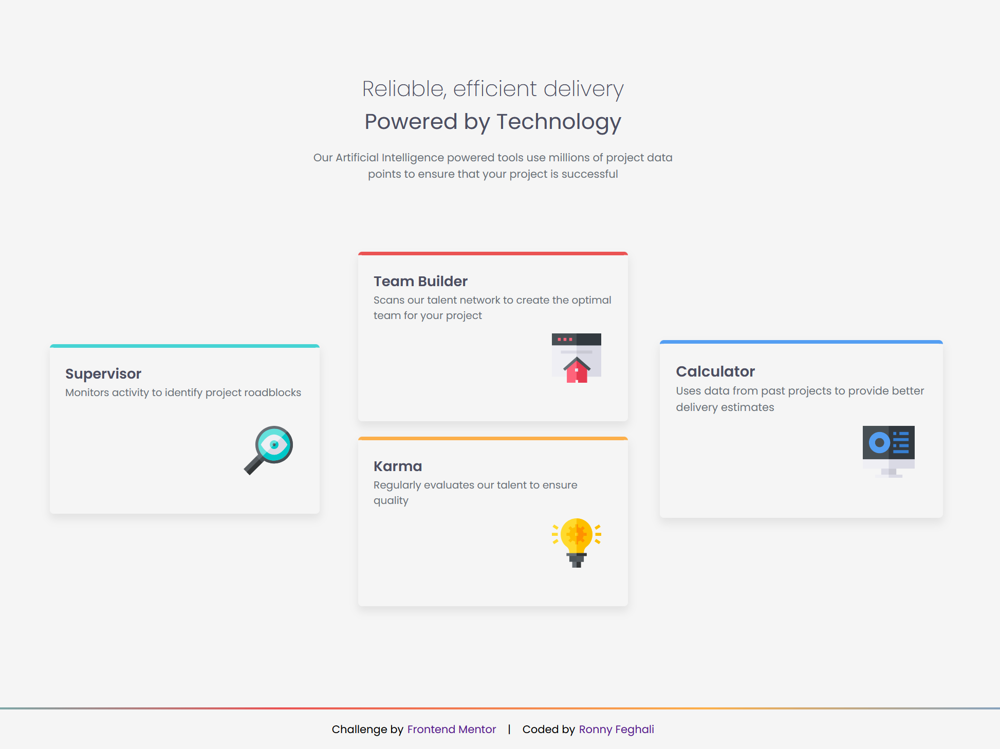
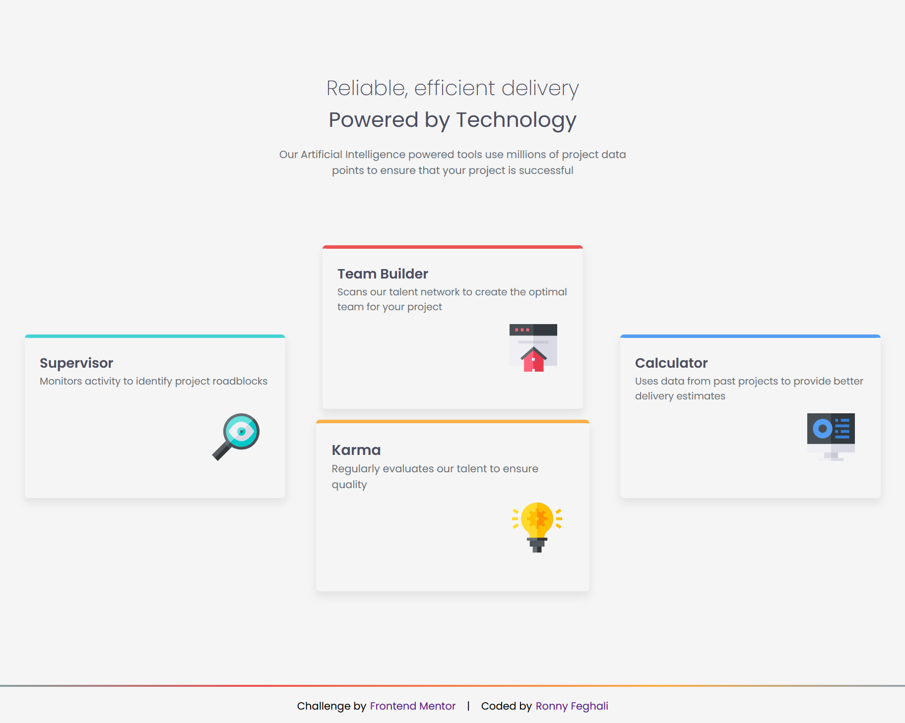

# Frontend Mentor - Four card feature section solution

This is a solution to the [Four card feature section challenge on Frontend Mentor](https://www.frontendmentor.io/challenges/four-card-feature-section-weK1eFYK).

## Table of contents

- [Overview](#overview)
  - [Level](#level)
  - [The challenge](#the-challenge)
  - [Screenshot](#screenshot)
  - [Links](#links)
- [My process](#my-process)
  - [Built with](#built-with)
  - [What I learned](#what-i-learned)
  - [Continued development](#continued-development)
  - [AI Collaboration](#ai-collaboration)
- [Author](#author)

## Overview

### Level
**Newbie**

### Screenshot

### The challenge

Users should be able to:

- View the optimal layout for the site depending on their device's screen size

### Links

- GitHub: [https://github.com/RonnyFeghali/frontend-mentor-challenges](https://github.com/RonnyFeghali/frontend-mentor-challenges)

## My process

### Built with

- Semantic HTML5 markup
- CSS custom properties
- Flexbox
- Responsive design with media queries

### What I learned

This was my first time working with media queries. I learned that the breakpoint value doesn't have to match the design spec exactly — using `max-width: 600px` instead of `375px` ensures the mobile styles apply across a wider range of real devices.

I also learned that `border-image` with a `linear-gradient` is the way to fake a gradient border in CSS, since `border-color` doesn't support gradients directly.

### Continued development

I want to get more comfortable with CSS positioning — specifically knowing intuitively when to use `position: absolute/relative` and how `top`, `bottom`, `left`, `right` interact with the parent container.

I also want to keep practicing media queries so I can write them confidently without needing to trial-and-error the breakpoints.

### AI Collaboration

I used Claude (claude.ai) as a mentor throughout this project. Claude didn't write code for me but helped me work through problems step by step — asking questions to guide me toward the solution rather than handing it to me.

Areas where Claude helped:
- Identifying why my media query wasn't triggering (breakpoint was too narrow)
- Debugging the extra space below the footer caused by `min-height: 100vh` on the wrong element
- Explaining how `border-image` works for gradient borders

## Author

- Frontend Mentor - [@RonnyFeghali](https://www.frontendmentor.io/profile/RonnyFeghali)
