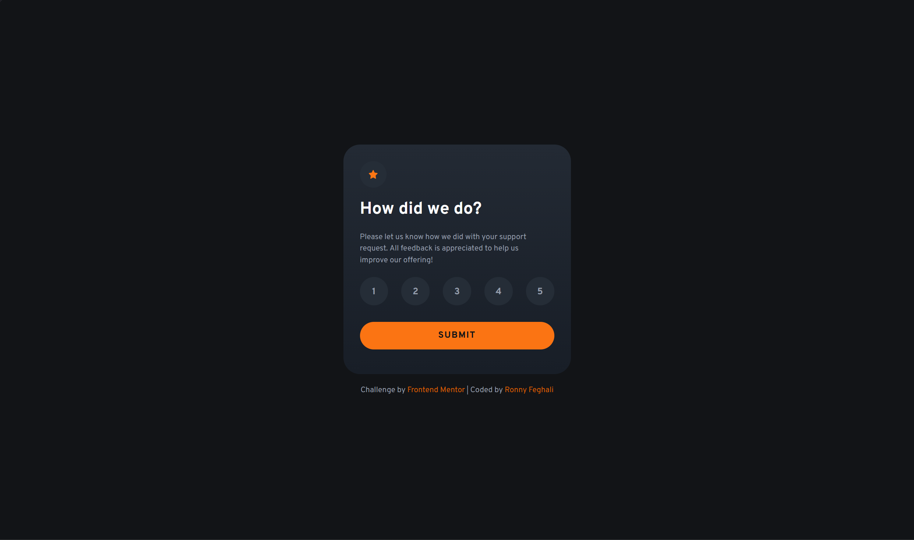
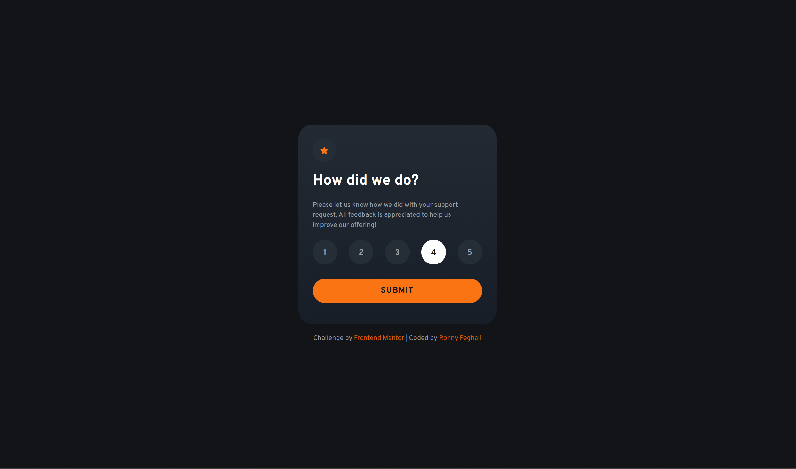
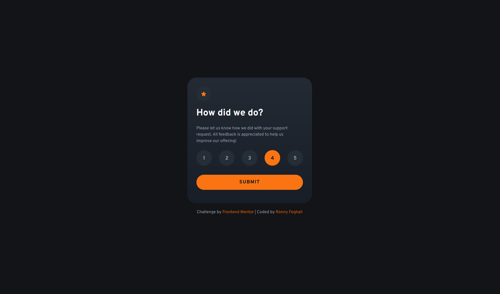
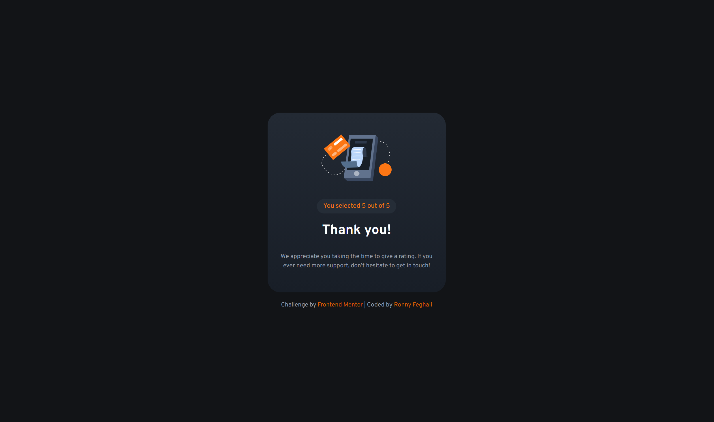

# Frontend Mentor - Interactive rating component solution

This is a solution to the [Interactive rating component challenge on Frontend Mentor](https://www.frontendmentor.io/challenges/interactive-rating-component-koxpeBUmI). Frontend Mentor challenges help you improve your coding skills by building realistic projects. 

## Table of contents

- [Overview](#overview)
  - [Level](#level)
  - [The challenge](#the-challenge)
  - [Screenshot](#screenshot)
  - [Links](#links)
- [My process](#my-process)
  - [Built with](#built-with)
  - [What I learned](#what-i-learned)
  - [Continued development](#continued-development)
  - [AI Collaboration](#ai-collaboration)
- [Author](#author)

## Overview

### Level
**Newbie**

### The challenge

Users should be able to:

- View the optimal layout for the app depending on their device's screen size
- See hover states for all interactive elements on the page
- Select and submit a number rating
- See the "Thank you" card state after submitting a rating

### Screenshot






### Links

- Solution URL: [Add solution URL here](https://your-solution-url.com)
- Live Site URL: [Add live site URL here](https://your-live-site-url.com)

## My process

### Built with

- Semantic HTML5 markup
- CSS custom properties (variables)
- Flexbox
- Vanilla JavaScript (DOM manipulation, event listeners)
- Mobile-first responsive design with media queries

### What I learned

I learned how to manage event listeners and DOM state effectively. Here's the JavaScript logic I'm proud of for handling the rating selection—it ensures only one button can be selected at a time:

```js
ratings.forEach(function(rating) {
    rating.addEventListener('click', function() {
        // Remove 'checked' class from all buttons first
        ratings.forEach(function(rating) {
            rating.classList.remove('checked')
        })
        
        // Update the display with selected rating
        userRating.textContent = rating.textContent
        userSelection.textContent = `You selected ${rating.textContent} out of 5`
        userSelection.style.color = 'var(--color-orange-500)'
        
        // Add 'checked' class to the clicked button
        rating.classList.add('checked')
    })
})
```

I also learned the importance of DRY (Don't Repeat Yourself) principles in CSS. By creating a shared `.state-container` class and using CSS custom properties for colors, fonts, and breakpoints, I reduced redundancy and made the code more maintainable.

### Continued development

I want to continue improving my JavaScript skills, particularly:
- Using more modern syntax (arrow functions, destructuring)
- Understanding event delegation for better performance
- Building more complex interactive components

## AI Collaboration

I used Claude to help guide me through this project as a learning tool:

**What worked well:**
- Claude helped me understand the difference between `min-width` and `max-width` in media queries
- When my JavaScript wasn't working (multiple buttons getting selected), Claude guided me through debugging by asking questions rather than giving me the answer
- Claude organized my CSS for better structure and helped me implement DRY principles with the `.state-container` class
- Claude explained CSS variable syntax and why they don't work in inline styles the way I initially thought

**Areas Claude assisted with:**
- CSS organization and commenting conventions
- Debugging the nested `forEach` loop logic—I wrote most of it, but Claude helped me understand why the order of operations mattered (removing 'checked' first, then adding it)
- Understanding responsive design patterns and phone/tablet breakpoints
- Explaining concepts like multiple HTML classes on a single element

**What I did independently:**
- All HTML structure and semantic markup
- JavaScript event listener logic (with guidance on the nested loop structure)
- CSS styling and layout decisions
- Media query values and responsive width adjustments

## Author

- Frontend Mentor - [@ronnyfeghali](https://www.frontendmentor.io/profile/RonnyFeghali)

