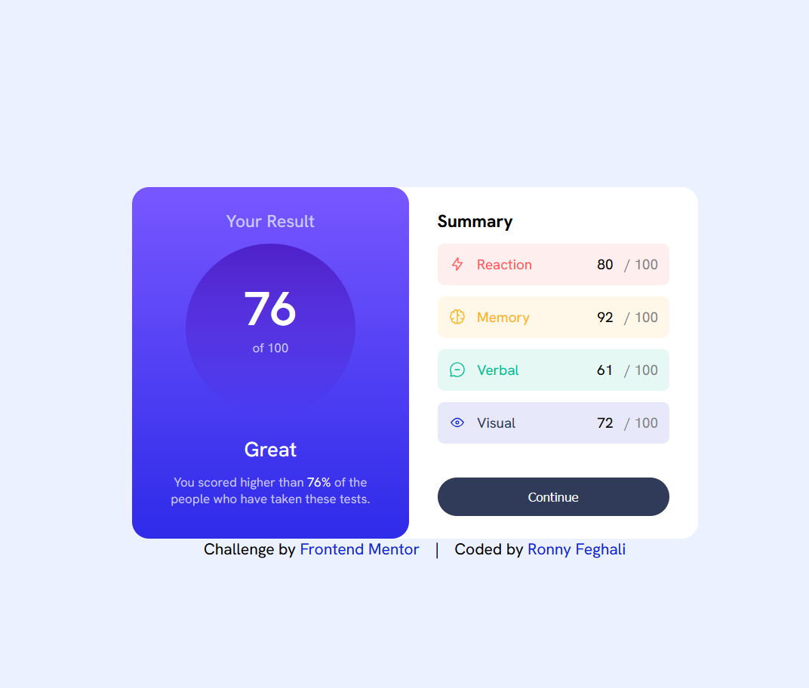
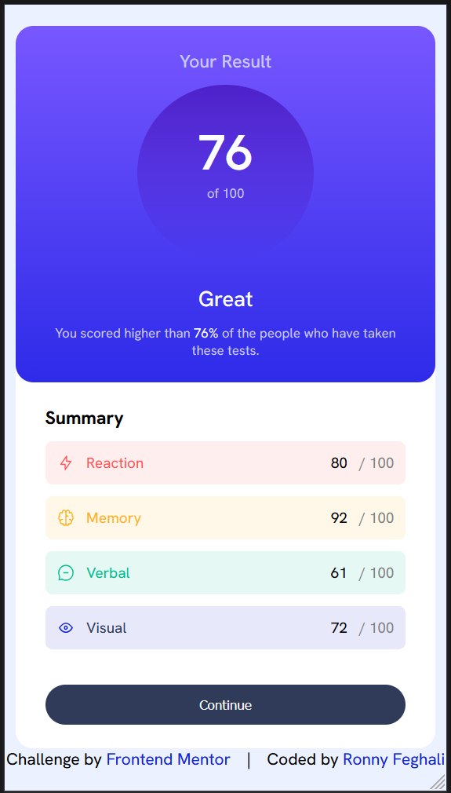

# Frontend Mentor - Results summary component solution

This is a solution to the [Results summary component challenge on Frontend Mentor](https://www.frontendmentor.io/challenges/results-summary-component-CE_K6s0maV). Frontend Mentor challenges help you improve your coding skills by building realistic projects.

## Table of contents

- [Overview](#overview)
  - [Level](#level)
  - [The challenge](#the-challenge)
  - [Screenshot](#screenshot)
  - [Links](#links)
- [My process](#my-process)
  - [Built with](#built-with)
  - [What I learned](#what-i-learned)
  - [Continued development](#continued-development)
  - [AI Collaboration](#ai-collaboration)
- [Author](#author)

## Overview

### Level
**Newbie**

### The challenge

Users should be able to:

- View the optimal layout for the interface depending on their device's screen size
- See hover and focus states for all interactive elements on the page
- **Bonus**: Use the local JSON data to dynamically populate the content

### Screenshot




### Links

- Solution URL: [Add solution URL here](https://your-solution-url.com)
- Live Site URL: [Add live site URL here](https://your-live-site-url.com)

## My process

### Built with

- Semantic HTML5 markup
- CSS custom properties
- Flexbox
- Vanilla JavaScript
- Mobile-first responsive design with media queries

### What I learned

**Using `fetch()` to load local JSON data dynamically:**

Instead of hardcoding the scores, I fetched them from `data.json` at runtime:

```js
fetch('./data.json')
  .then(response => response.json())
  .then(data => {
    reactionEl.textContent = data[0].score
    memoryEl.textContent = data[1].score
    verbalEl.textContent = data[2].score
    visualEl.textContent = data[3].score

    const average = Math.round(
      (data[0].score + data[1].score + data[2].score + data[3].score) / 4
    )
    scoreEl.textContent = average
    percentageEl.textContent = average + '%'
  })
```

**Using `margin-right: auto` in flexbox to push content apart:**

Instead of using `justify-content: space-between` (which would spread all items),
I applied `margin-right: auto` to the category name element to push the score group
to the far right while keeping the icon and label grouped on the left.

```css
.reaction, .memory, .verbal, .visual {
  margin-right: auto;
}
```

**Responsive layout with a single media query:**

The desktop layout uses a side-by-side flexbox row. On mobile, a single media query
flips it to a column:

```css
@media (max-width: 600px) {
  main {
    flex-direction: column;
    width: 95%;
  }
}
```

**Always link your stylesheet:**

A reminder to always include `<link rel="stylesheet" href="style.css">` in `<head>`.
Forgetting it means no CSS applies at all — easy to miss when you're tired.

**Using `flex: 1` for equal-width flex children:**

Both panels (`.results` and `.summary`) were growing based on content size, making
the left panel wider. Adding `flex: 1` to the shared rule forces them to split the
space equally regardless of content:

```css
.results,
.summary {
  flex: 1;
}
```

**`scale()` takes a decimal, not a percentage:**

```css
/* correct */
transform: scale(1.05);

/* avoid */
transform: scale(105%);
```

**Adding opacity to a CSS custom property using `color-mix()`:**

You can't pass opacity directly into `var()`, but `color-mix()` lets you do it inline:

```css
background-color: color-mix(in srgb, var(--light-red) 10%, transparent);
```

### Continued development

- Getting more comfortable with asynchronous JavaScript and the `fetch()` API
- Exploring `async/await` as an alternative to `.then()` chaining
- Improving instincts around when to use `margin: auto` vs other flexbox alignment techniques
- Building more confidence with responsive design and when to reach for media queries

### AI Collaboration

I used two AI assistants throughout this project: Kaylos (a personal AI app I built) and Claude (by Anthropic), both as guides and thinking partners.

- **How I used them:** I asked questions as I built — nothing was generated for me. They
  explained concepts, pointed out bugs, and let me make the decisions.
- **What worked well:** Having assistants that could read my actual files and give
  feedback based on my real code rather than generic examples was very useful.
- **What I'd do differently:** Trust my own instincts a bit more — several times I second-guessed
  myself and the original approach turned out to be correct.

## Author

- Website - [Ronny Feghali](https://www.your-site.com)
- Frontend Mentor - [@RonnyFeghali](https://www.frontendmentor.io/profile/yourusername)