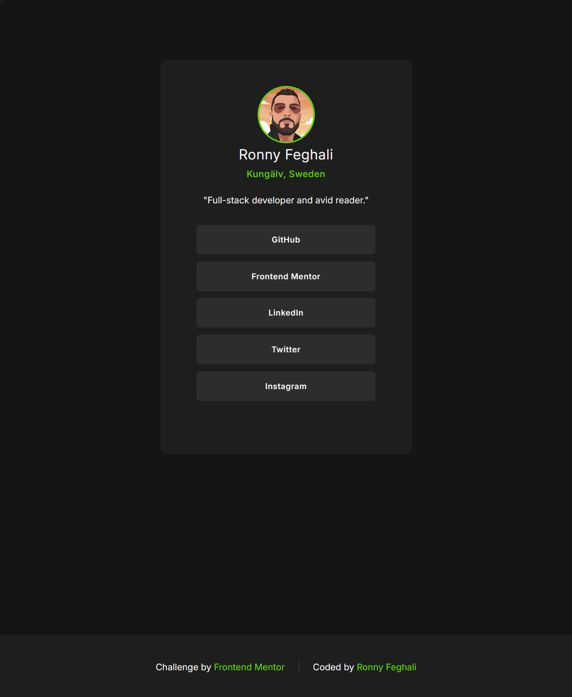
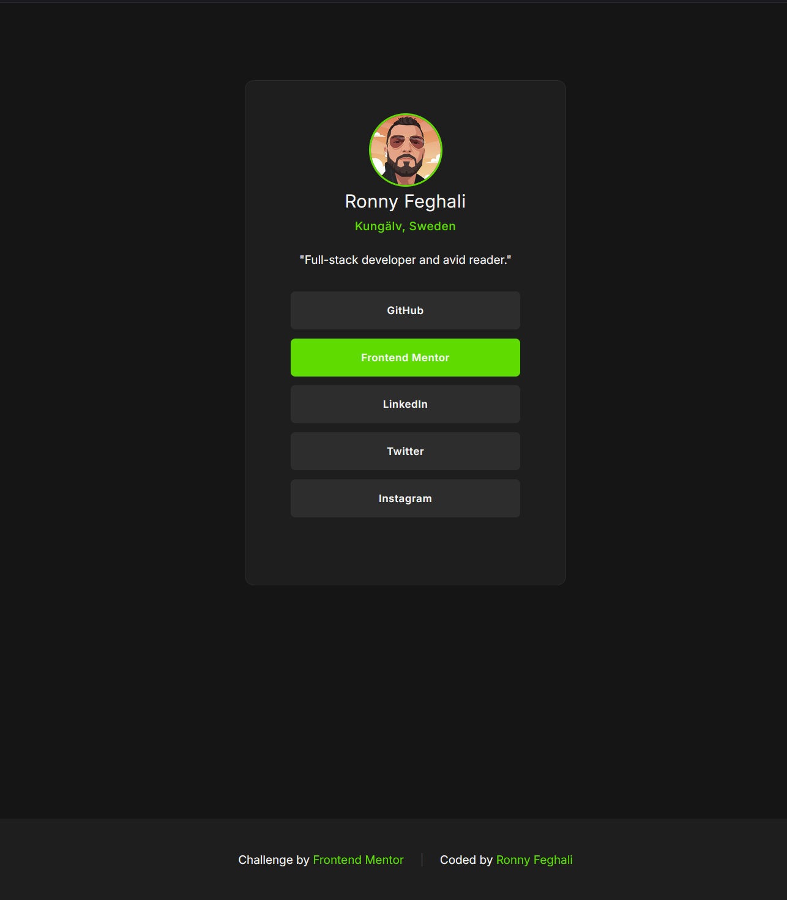

# Frontend Mentor - Social links profile solution

This is a solution to the [Social links profile challenge on Frontend Mentor](https://www.frontendmentor.io/challenges/social-links-profile-UG32l9m6dQ). Frontend Mentor challenges help you improve your coding skills by building realistic projects. 

## Table of contents

- [Overview](#overview)
  - [The challenge](#the-challenge)
  - [Screenshot](#screenshot)
  - [Links](#links)
- [My process](#my-process)
  - [Built with](#built-with)
  - [What I learned](#what-i-learned)
  - [Challenges](#challenges)
  - [Continued development](#continued-development)
  - [AI Collaboration](#ai-collaboration)
- [Author](#author)


## Overview

### The challenge

Users should be able to:

- See hover and focus states for all interactive elements on the page

### Screenshot





### Links

- Solution URL: [Add solution URL here](https://your-solution-url.com)
- Live Site URL: [Add live site URL here](https://your-live-site-url.com)

## My process

### Built with

- Semantic HTML5 markup
- Flexbox
- CSS Custom Properties
- Mobile-first workflow


### What I learned

I learned how to make an entire list item clickable by applying display: block and padding to the <a> tag instead of the <li>. This ensures a better user experience as the whole button area becomes an active link.

To see how you can add code snippets, see below:

```css
ul li a {
    display: block;
    padding: 1rem 2rem;
    width: 100%;
}
```

### Challenges
The first issue I had with the footer was that the anchor tags were "stretching" vertically, creating an appearance of excessive padding at the bottom of the links.

**Solutions:**
1. *Changing the Alignment:* I added `align-items: center;` to the `.attribution` class. By default, flexbox uses stretch, which pulls children to fill the entire height of the container. Switching this to center told the browser to let the links stay at their natural height.

2. *Grouping the Content:* I wrapped the text and links inside a single container (like a <p> tag) within the footer. This prevented flexbox from treating every single word as an individual "flex item" that it needed to align and stretch separately.

### Continued development

* **Flexbox layouts**: I want to get more comfortable with how `justify-content` and `align-items` behave when nested inside different containers.

### AI Collaboration

* **Problem Solving:** I initially struggled with the footer layout and vertical stretching of links. The AI helped me understand how align-items and justify-content interact within a Flexbox container.

* **Refactoring:** I didn't know about CSS Custom Properties at first, but Gemini explained them to me and helped me refactor them into a centralized `:root` block for better maintainability.


## Author

- Website - [Ronny](https://www.your-site.com)
- Frontend Mentor - [@RonnyFeghali](https://www.frontendmentor.io/profile/RonnyFeghali)


