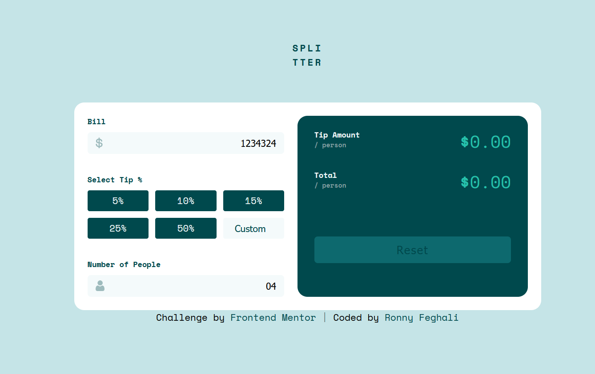

# Frontend Mentor - Tip calculator app solution

This is a solution to the [Tip calculator app challenge on Frontend Mentor](https://www.frontendmentor.io/challenges/tip-calculator-app-ugJNGbJUX). Frontend Mentor challenges help you improve your coding skills by building realistic projects.

## Table of contents

- [Overview](#overview)
  - [Level](#level)
  - [The challenge](#the-challenge)
  - [Screenshot](#screenshot)
  - [Links](#links)
- [My process](#my-process)
  - [Built with](#built-with)
  - [What I learned](#what-i-learned)
  - [Continued development](#continued-development)
  - [AI Collaboration](#ai-collaboration)
- [Author](#author)

## Overview

### Level
**Junior**

### The challenge

Users should be able to:

- View the optimal layout for the app depending on their device's screen size
- See hover states for all interactive elements on the page
- Calculate the correct tip and total cost of the bill per person

### Screenshot



### Links

- Solution URL: [Add solution URL here](https://your-solution-url.com)
- Live Site URL: [Add live site URL here](https://your-live-site-url.com)

## My process

### Built with

- Semantic HTML5 markup
- CSS custom properties
- Flexbox
- CSS Grid
- Vanilla JavaScript

### What I learned

This was my first time writing JavaScript from scratch without a framework. A few things that stood out:

Using `data-*` attributes to store values directly on HTML elements, then reading them in JS with `dataset`:

```html
<button class="tip-btn" data-tip="15">15%</button>
```

```js
selectedTip = button.dataset.tip
```

Using `forEach` to attach event listeners to multiple elements at once, and removing/adding a class to track the active button:

```js
tipButtons.forEach(function(button) {
    button.addEventListener('click', function() {
        tipButtons.forEach(btn => btn.classList.remove('active'))
        button.classList.add('active')
    })
})
```

Using `position: absolute` on an icon inside a `position: relative` wrapper to overlay it on an input field without affecting layout:

```css
.input-wrapper {
    position: relative;
}

.input-icon {
    position: absolute;
    left: 12px;
    top: 50%;
    transform: translateY(-50%);
}
```

### Continued development

Going forward I want to focus on:

- JavaScript fundamentals — this project was my first real JS experience and I want to get more comfortable with DOM manipulation and events
- Responsive design and media queries — this project doesn't have a mobile layout yet
- Improving my understanding of CSS layout, particularly when Flexbox vs Grid is the better choice

### AI Collaboration

I used Claude (via Claude Code) throughout this project as a learning partner rather than a code generator.

- **What I used it for:** asking concept questions ("what's the difference between `:active` and `.active`?"), catching bugs I introduced, explaining why something wasn't working, and reviewing my code before moving to the next step
- **What worked well:** stepping through the JavaScript together piece by piece — I drove the structure and logic, but Claude filled in syntax I hadn't encountered before (like `forEach`, `parseFloat`, `dataset`). It explained each piece as we went rather than just handing me a finished solution, which meant I understood what was written even when I didn't write it from scratch.
- **What didn't work:** autocomplete kept interfering when typing `.value`, which caused a few confusing bugs

## Author

- Frontend Mentor - [@RonnyFeghali](https://www.frontendmentor.io/profile/RonnyFeghali)
